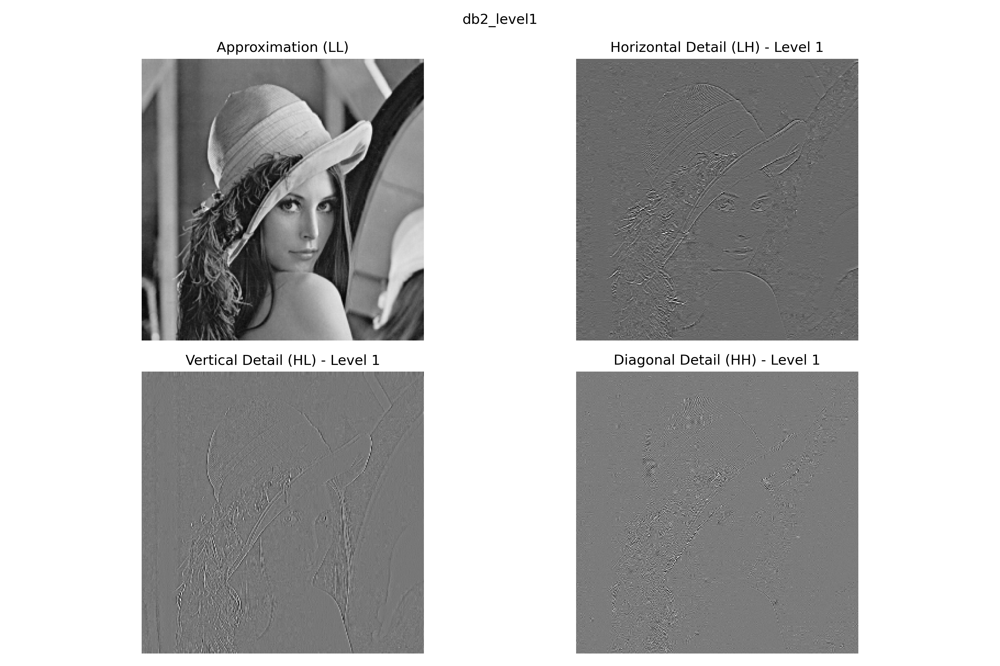
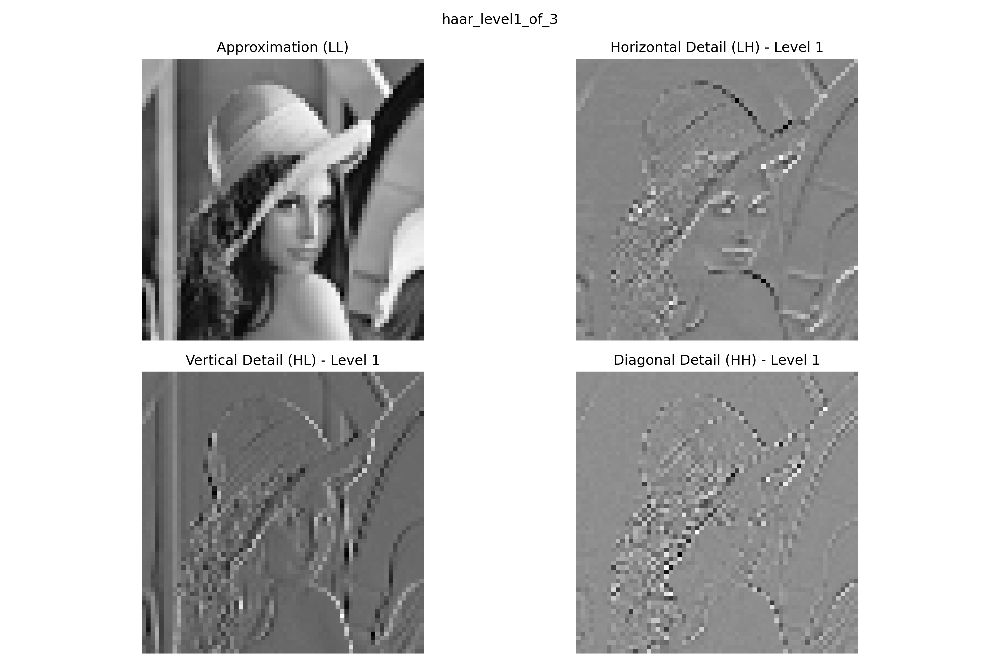
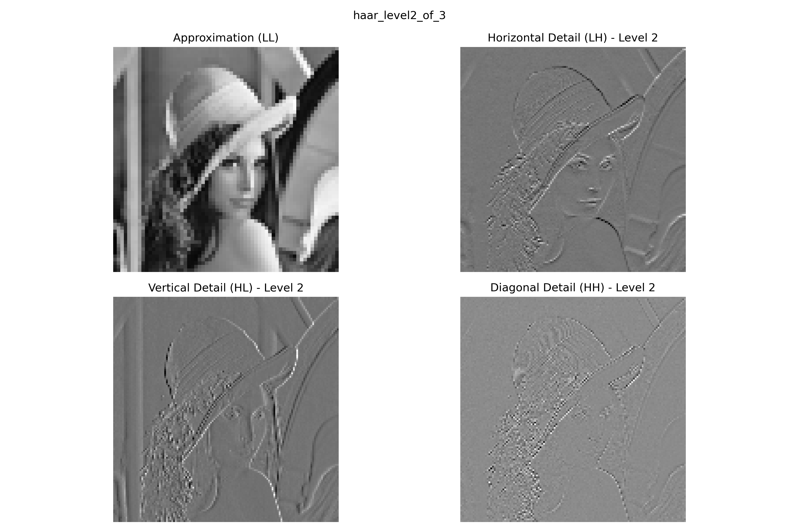
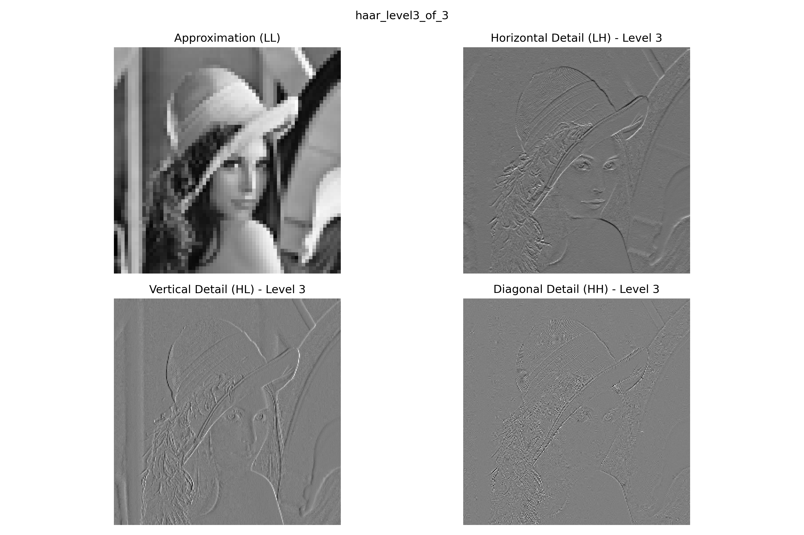
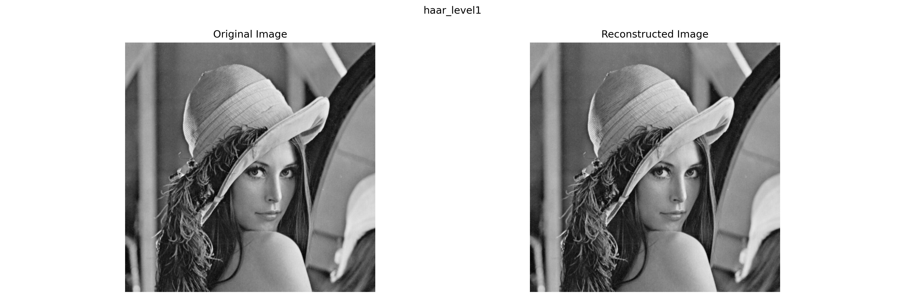

# Wavelet Transform Image Processing

This project demonstrates the application of wavelet transform for digital image processing. It focuses on:

1. Decomposing images into approximation and detail coefficients
2. Visualizing the wavelet subbands
3. Reconstructing images from wavelet coefficients
4. Analyzing the effects of different wavelet bases and decomposition levels
5. Exploring coefficient thresholding for image enhancement

## Visual Examples

### Original Image


### Wavelet Decomposition with Haar Wavelet (Level 1)


### Wavelet Decomposition with Daubechies Wavelet (Level 1)


### Multi-Level Decomposition (Levels 1-3)




### Image Reconstruction Comparison


## Quick Start

```bash
# Clone the repository (if applicable)
git clone <repository-url>
cd <repository-directory>/decomposition_visualization

# Install dependencies
pip install -r requirements.txt

# Run the program
python main.py
```

The program will:
1. Load a sample image (or create a test pattern if none exists)
2. Perform wavelet decomposition using Haar and Daubechies (db2) wavelets
3. Display and save visualizations of the wavelet coefficients
4. Reconstruct the images and calculate quality metrics
5. Generate a comprehensive report in the results directory

## Prerequisites

The project requires the following Python libraries:
- NumPy
- Matplotlib
- PyWavelets
- scikit-image
- Pathlib

You can install all dependencies using:

```bash
pip install numpy matplotlib pywavelets scikit-image
```

## Project Structure

```
decomposition_visualization/
│
├── wavelet_transform.py   # Core functions for wavelet transform operations
├── main.py                # Main script to run the analysis
├── README.md              # This file
│
├── samples/               # Directory for input images
│   ├── balanced.jpg       # Sample image
│   └── color_balanced.jpg # Sample image
│
└── results/               # Output directory for visualizations and report
    ├── original_image.png
    ├── haar_level1.png
    ├── db2_level1.png
    ├── comparison_haar_level1.png
    ├── haar_level1_of_3.png
    ├── haar_level2_of_3.png
    ├── haar_level3_of_3.png
    ├── comparison_haar_multilevel_3.png
    └── ...
```

## Usage

1. (Optional) Place your grayscale test images in the `samples` directory. If no images are found, a test pattern will be generated automatically.

2. Run the main script:

```bash
python main.py
```

3. View the results in the `results` directory:
   - Visualizations of wavelet coefficients
   - Comparisons between original and reconstructed images
   - Metrics for reconstruction quality (MSE and PSNR)
   - Analysis report in Markdown format

## Features

### 1. Wavelet Decomposition

The program implements 2D wavelet transform using various wavelet bases:
- **Haar wavelet**: Simplest orthogonal wavelet with sharp transitions
  
- **Daubechies wavelet (db2)**: Offers smoother transitions and better frequency localization
  

### 2. Multi-Level Analysis

The implementation supports multi-level decomposition to analyze image structures at different scales.


### 3. Coefficient Visualization

The program visualizes:
- Approximation coefficients (LL)
- Horizontal detail coefficients (LH)
- Vertical detail coefficients (HL)
- Diagonal detail coefficients (HH)

Each showing different spatial-frequency characteristics of the image.

### 4. Image Reconstruction

Images are reconstructed using the inverse wavelet transform, allowing for:
- Verification of perfect reconstruction
- Quality assessment using MSE and PSNR metrics



### 5. Coefficient Thresholding

Optional enhancement through coefficient thresholding to:
- Reduce noise
- Analyze the impact on reconstruction quality
- Demonstrate wavelet-based image enhancement

## Results Interpretation

The wavelet transform decomposes the image into:
- **Approximation (LL)**: Overall structure and low-frequency content
- **Horizontal Details (LH)**: Vertical edges/features
- **Vertical Details (HL)**: Horizontal edges/features
- **Diagonal Details (HH)**: Diagonal structures and high-frequency content

Higher decomposition levels provide increasingly coarse representations of the image, while detail coefficients at each level capture different frequency bands. 