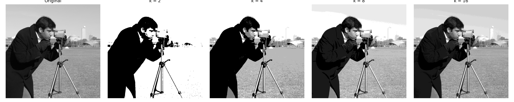
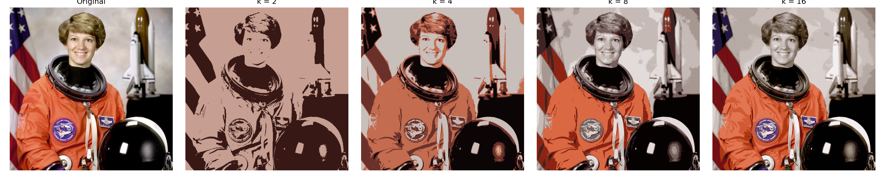
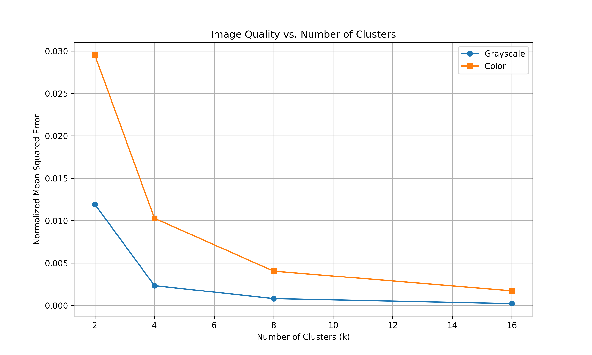
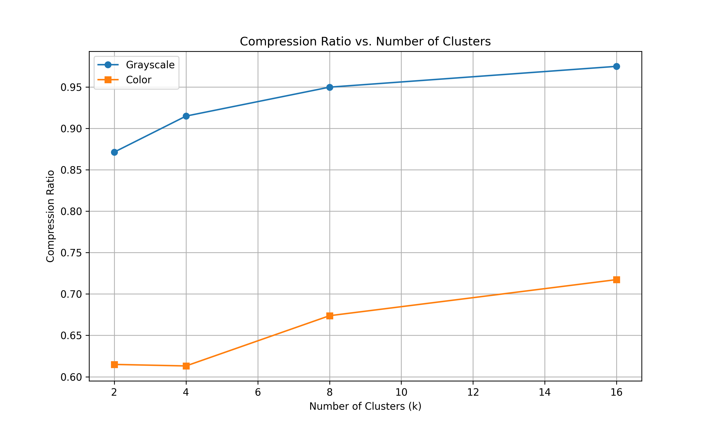
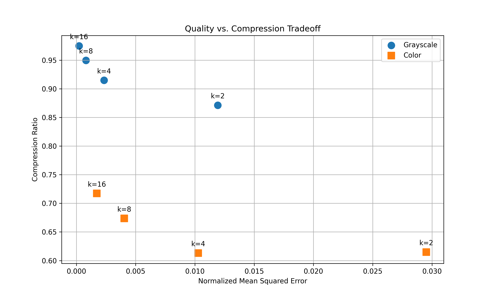

# Image Segmentation with K-means Clustering

This project demonstrates the application of k-means clustering for unsupervised image segmentation, with analysis of how segmentation affects image compressibility.

## Objective

The main goals of this project are:
1. Apply k-means clustering to segment grayscale and color images
2. Evaluate segmentation quality using mean squared error
3. Analyze the effect of segmentation on image compressibility
4. Visualize the relationship between image quality and compression

## Requirements

- Python 3.x
- NumPy
- OpenCV
- scikit-learn
- matplotlib
- scikit-image

## Project Structure

```
image-segmentation/
│
├── data/
│   ├── input/             # Input images
│   └── results/           # Results and visualizations
│       ├── grayscale/     # Grayscale image results
│       └── color/         # Color image results
│
├── download_images.py     # Script to download sample images
├── kmeans_segmentation.py # Main script for image segmentation
└── README.md              # This file
```

## How to Run

1. First, download the sample images:

```
python download_images.py
```

2. Run the main segmentation script:

```
python kmeans_segmentation.py
```

## Introduction

### Purpose of Segmentation
Image segmentation is the process of partitioning an image into multiple segments (regions) to simplify its representation and make it more meaningful for analysis. In this project, we use k-means clustering for unsupervised segmentation.

### K-means Clustering
K-means clustering is an unsupervised machine learning algorithm that groups similar data points together. When applied to images, it groups pixels with similar values (intensity or color) into k clusters. Each pixel is then replaced with its corresponding cluster centroid value, resulting in a segmented image with only k distinct values.

K-means is useful for image segmentation because:
- It simplifies image representation
- It can identify regions with similar properties
- It operates without requiring labeled data
- It reduces the color/intensity space of the image, which can impact compressibility

## Methodology

### K-means Clustering for Image Segmentation
In this project, we segment images using the following approach:
- For grayscale images, pixels are clustered in 1D space (intensity values)
- For color images, pixels are clustered in 3D space (RGB values)
- Each pixel is assigned to the nearest cluster centroid
- After clustering, each pixel is replaced with its corresponding cluster centroid

### Preprocessing
- Images are loaded using OpenCV
- Color images are converted from BGR to RGB for visualization
- Pixels are reshaped into a feature matrix for clustering

### Evaluation Metrics
- **Mean Squared Error (MSE)**: Measures the average squared difference between original and segmented pixel values
- **Normalized MSE**: MSE divided by the square of the maximum possible pixel value (255²)
- **Compression Ratio**: The ratio of the compressed file size to the original file size

## Experiments and Results

### Grayscale Image

Grayscale segmentation was performed on a standard camera image with varying k values.



For each k value:

#### k = 2
- **Normalized MSE**: 0.011925
- **Compression Ratio**: 0.871397

#### k = 4
- **Normalized MSE**: 0.002333
- **Compression Ratio**: 0.914894

#### k = 8
- **Normalized MSE**: 0.000805
- **Compression Ratio**: 0.949848

#### k = 16
- **Normalized MSE**: 0.000221
- **Compression Ratio**: 0.974984

### Color Image

Color segmentation was performed on the astronaut image with varying k values.



For each k value:

#### k = 2
- **Normalized MSE**: 0.029526
- **Compression Ratio**: 0.614944

#### k = 4
- **Normalized MSE**: 0.010274
- **Compression Ratio**: 0.613093

#### k = 8
- **Normalized MSE**: 0.004042
- **Compression Ratio**: 0.673773

#### k = 16
- **Normalized MSE**: 0.001728
- **Compression Ratio**: 0.717374

### Results Summary

| k value | Grayscale NMSE | Grayscale Compression Ratio | Color NMSE | Color Compression Ratio |
|---------|---------------|----------------------------|-----------|------------------------|
| 2 | 0.011925 | 0.871397 | 0.029526 | 0.614944 |
| 4 | 0.002333 | 0.914894 | 0.010274 | 0.613093 |
| 8 | 0.000805 | 0.949848 | 0.004042 | 0.673773 |
| 16 | 0.000221 | 0.974984 | 0.001728 | 0.717374 |

## Evaluation and Discussion

### Effect of K on Image Quality



As k increases, the normalized mean squared error (NMSE) decreases significantly for both grayscale and color images, indicating improved image quality:

- For grayscale images, NMSE decreases from 0.011925 with k=2 to 0.000221 with k=16, representing a 98% reduction in error.
- For color images, NMSE decreases from 0.029526 with k=2 to 0.001728 with k=16, representing a 94% reduction in error.

Visually, higher k values preserve more details and edges in the images. With k=2, only the most prominent features are visible, while k=16 captures much more subtle variations in intensity and color.

### Effect of Segmentation on Compressibility



The compression ratio increases with k for both image types:

- For grayscale images, compression ratio increases from 0.871397 with k=2 to 0.974984 with k=16.
- For color images, compression ratio increases from 0.614944 with k=2 to 0.717374 with k=16.

This indicates that images with more clusters (higher k) are less compressible. This is expected because:
1. Higher k values introduce more distinct pixel values in the segmented image
2. More distinct values create more complex patterns that are harder to compress
3. Lower k values create larger uniform regions that compress more efficiently

Interestingly, color images show better compressibility (lower compression ratios) than grayscale images across all k values, likely due to the removal of subtle color variations that the human eye may not easily perceive.

### Quality-Compression Trade-off



The quality-compression tradeoff plot clearly demonstrates the inverse relationship between image quality and compressibility:

- Lower k values (2, 4) provide better compression but lower image quality
- Higher k values (8, 16) preserve more image details but reduce compressibility
- The tradeoff is more pronounced for color images than for grayscale images

For applications where storage or transmission efficiency is critical, lower k values may be preferred. For applications requiring high fidelity, higher k values would be more appropriate.

## Conclusion

### Summary of Findings

Our experiments confirm several key findings:

1. K-means clustering effectively segments both grayscale and color images into a predefined number of clusters.
2. Image quality improves significantly as the number of clusters (k) increases, with diminishing returns at higher k values.
3. Compression efficiency decreases as k increases, demonstrating a clear tradeoff between quality and compressibility.
4. Color images generally show higher error but better compressibility compared to grayscale images.

### Practical Applications

These findings have applications in:

- Image compression systems where variable quality/size tradeoffs are desired
- Medical image processing where simplification can highlight certain features
- Satellite image analysis for land use classification
- Object detection preprocessing to reduce feature complexity
- Art and design for creating posterized visual effects

### Future Work

Potential directions for future research include:

- Testing different clustering algorithms beyond k-means
- Exploring adaptive k-selection based on image content
- Comparing segmentation in different color spaces (Lab, HSV)
- Implementing region-based segmentation rather than pixel-based
- Combining segmentation with traditional compression algorithms
- Applying perceptual quality metrics like SSIM instead of MSE

## References

- Scikit-learn: Machine Learning in Python, Pedregosa et al., JMLR 12, pp. 2825-2830, 2011.
- OpenCV: Open Source Computer Vision Library.
- Gonzalez, R. C., & Woods, R. E. (2018). Digital image processing (4th ed.). Pearson.
- Walt, S. van der, Schönberger, J. L., et al. (2014). scikit-image: Image processing in Python. PeerJ, 2:e453. 