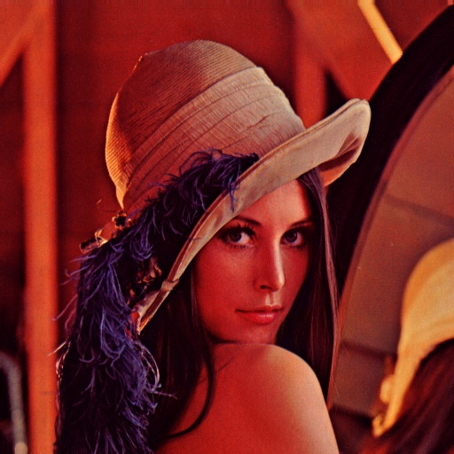
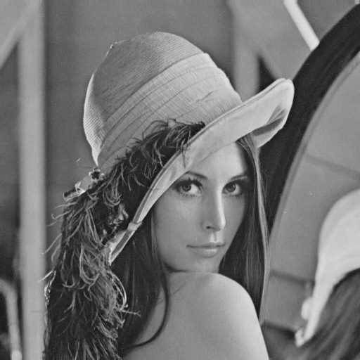
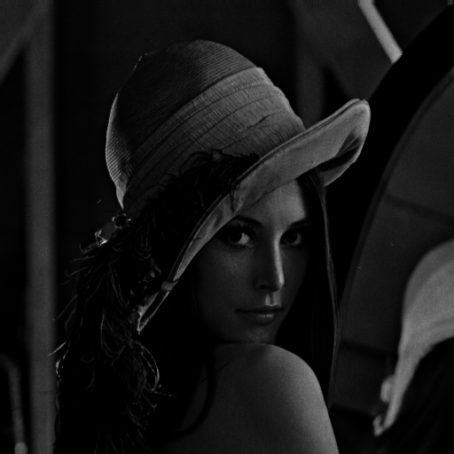
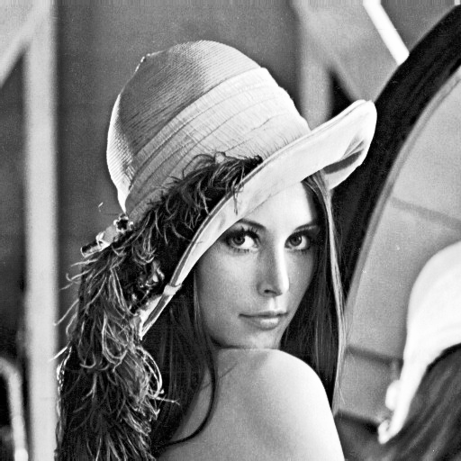
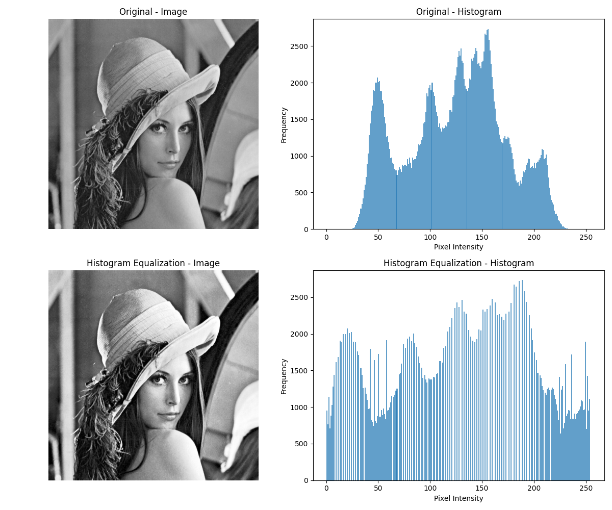
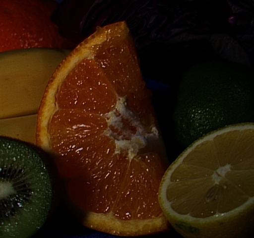
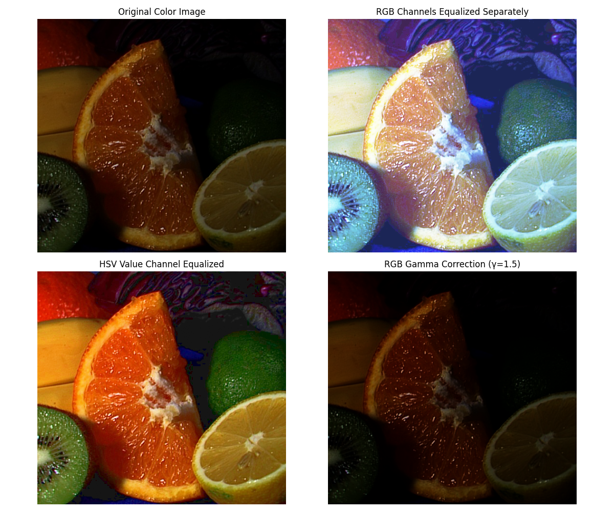
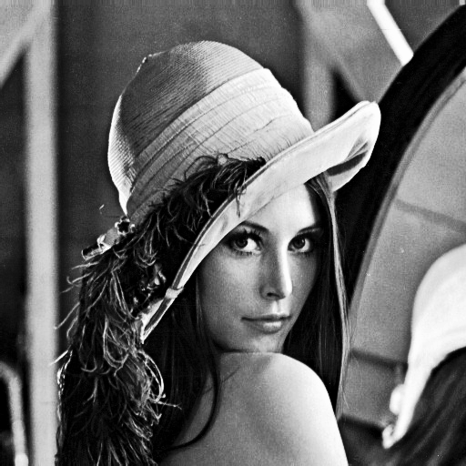

# Gamma Correction and Histograms 🖼️

[](https://www.python.org/downloads/)
[](https://github.com/psf/black)

## 📋 Overview

A robust image enhancement toolkit that implements various point processing techniques, specializing in gamma correction and histogram equalization. This tool provides comprehensive analysis capabilities for both quantitative and visual assessment of image enhancement operations.

## 📸 Example Results

### Gamma Correction
| Original Image | Gamma = 0.5 | Gamma = 2.0 |
|:-------------:|:-----------:|:-----------:|
|  |  |  |
| Underexposed Scene | Brightened (γ=0.5) | Darkened (γ=2.0) |

### Histogram Equalization
| Original Image | Equalized Result | Histogram Comparison |
|:-------------:|:----------------:|:-------------------:|
|  |  |  |
| Original Image | Enhanced Contrast | Histogram Analysis |

### Color Processing (HSV)
| Original Image | Enhanced Result |
|:-------------:|:--------------:|
|  |  |
| Original Color Image | Enhanced using HSV Processing |

### Combined Operations
| Original Image | Gamma then Equalization | Equalization then Gamma |
|:-------------:|:----------------------:|:----------------------:|
|  |  |  |
| Original Image | Gamma → Equalization | Equalization → Gamma |

## ✨ Key Features

- 🔆 **Advanced Gamma Correction**
  - Dynamic brightness and contrast adjustment
  - Customizable gamma values for precise control
  - Optimal for correcting under/overexposed images

- 📊 **Histogram Equalization**
  - Automated contrast enhancement
  - Intelligent pixel intensity redistribution
  - Support for both global and adaptive methods

- 🎨 **Color Processing**
  - Multi-channel RGB processing
  - HSV color space transformation
  - Channel-specific enhancement capabilities

- 📈 **Analysis Tools**
  - Real-time statistical analysis
  - Before/after comparisons
  - Detailed performance metrics

## 🚀 Quick Start

### Prerequisites

Ensure you have Python 3.6 or higher installed on your system.

### Installation

1. Clone the repository:
```bash
git clone https://github.com/MustafaaCENG/image-enhancement.git
cd image-enhancement
```

2. Install required dependencies:
```bash
pip install -r requirements.txt
```

### Basic Usage

1. Prepare your images:
```bash
mkdir -p images
# Place your images in the 'images' directory
```

2. Run the enhancement tool:
```bash
python image_enhancement.py
```

3. Find your results in the `results` directory

## 💡 Technical Details

### Gamma Correction Implementation

The gamma correction follows the power-law transformation:

\[ O = I^\gamma \]

Where:
- O = Output pixel intensity
- I = Input pixel intensity (normalized)
- γ = Gamma value

### Histogram Equalization Process

1. Histogram computation
2. CDF calculation
3. Intensity mapping
4. Final transformation

### Color Processing Approaches

1. **RGB Channel Processing**
   - Independent channel enhancement
   - Channel-specific gamma values
   - RGB histogram analysis

2. **HSV Space Processing**
   - Value channel enhancement
   - Hue preservation
   - Saturation management

## 📊 Performance Metrics

Example output format:

```
Image Analysis Results
---------------------
Original Image
- Mean Intensity: 0.1234
- Standard Deviation: 0.0567
- Dynamic Range: [0.0000, 0.7890]

Enhanced Image
- Mean Intensity: 0.3456
- Standard Deviation: 0.0789
- Dynamic Range: [0.0123, 0.9876]
```

## 📝 License

This project is licensed under the MIT License - see the [LICENSE](LICENSE) file for details.

## 📬 Contact

Mustafa - [@MustafaaCENG](https://github.com/MustafaaCENG)

Project Link: [https://github.com/MustafaaCENG/image-enhancement](https://github.com/MustafaaCENG/image-enhancement)

AI tool used: [Claude Sonnet 3.7](https://claude.ai/)