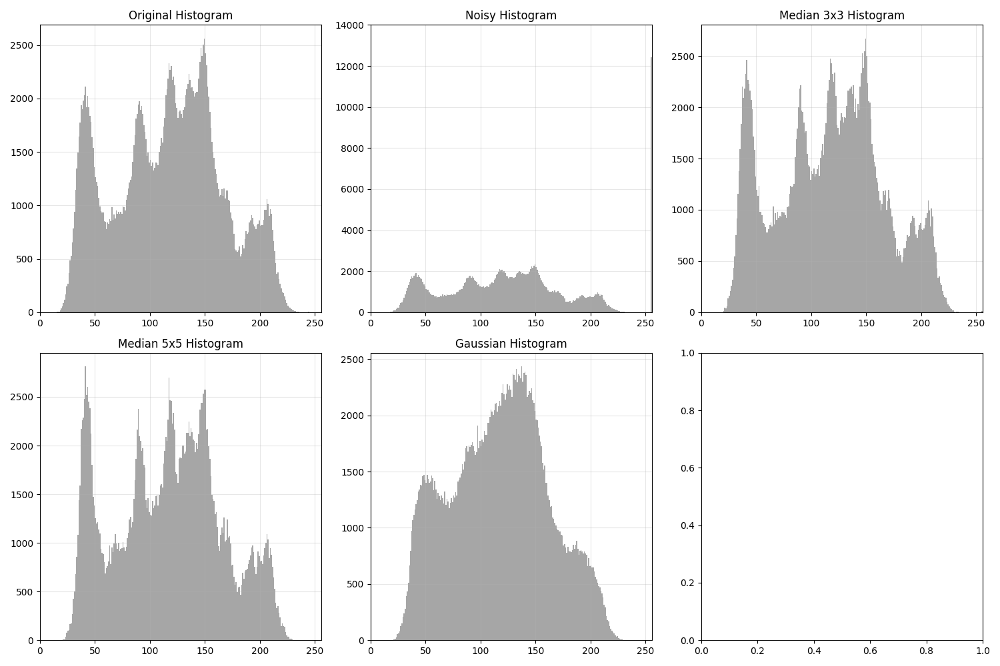
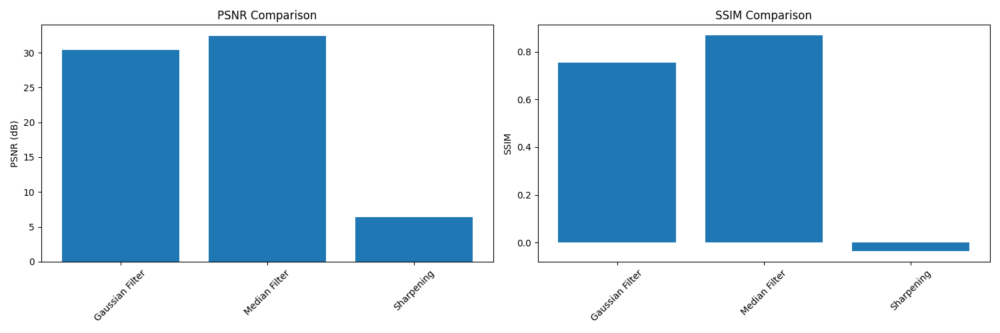
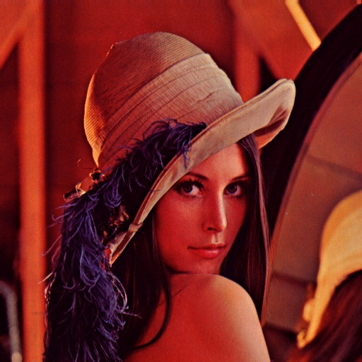

# Spatial Image Processing Library

A comprehensive Python library for advanced spatial filtering and image processing techniques, providing robust implementations of various filters, edge detection algorithms, and image enhancement methods.

## Overview

This library implements state-of-the-art spatial filtering techniques for digital image processing, with a focus on noise reduction, edge detection, and image enhancement. It provides both academic and practical implementations of fundamental image processing algorithms, complete with performance metrics and visualization tools. The project is developed with the assistance of Claude 3.7 Sonnet AI (@https://claude.ai/).

## Key Features

- **Advanced Filtering Techniques**
  - Gaussian smoothing with customizable kernels
  - Adaptive median filtering for impulse noise removal
  - Unsharp masking for detail enhancement
  
- **Edge Detection Algorithms**
  - Sobel operator with gradient magnitude and direction
  - Prewitt operator implementation
  - Laplacian edge detection
  
- **Image Enhancement**
  - Noise reduction pipelines
  - Detail preservation techniques
  - Customizable sharpening algorithms
  
- **Analysis Tools**
  - Quantitative performance metrics (PSNR, SSIM)
  - Visual comparison utilities
  - Histogram analysis

## Technical Requirements

### Dependencies
```bash
numpy>=1.19.0
opencv-python>=4.5.0
matplotlib>=3.3.0
scikit-image>=0.18.0
```

### System Requirements
- Python 3.6 or higher

## Installation

1. Clone the repository:
```bash
git clone https://github.com/MustafaaCENG/spatial-filtering.git
cd spatial-filtering
```

2. Install required packages:
```bash
pip install -r requirements.txt
```

## Quick Start

1. Prepare your environment:
```bash
# Create directory for test images
mkdir test_images
```

2. Run the demonstration:
```bash
python main.py
```

## Usage Examples

### Basic Filtering
```python
import spatial_filters as sf

# Apply Gaussian smoothing
filtered_image = sf.apply_gaussian_filter(image, kernel_size=5, sigma=1.0)

# Enhance image details
sharpened = sf.unsharp_masking(image, kernel_size=5, sigma=1.0, amount=1.5)
```

### Edge Detection
```python
# Sobel edge detection with gradient information
edges, magnitude, direction = sf.sobel_edge_detection(image)

# Prewitt edge detection
edges, magnitude = sf.prewitt_edge_detection(image)
```

## Project Structure

```
spatial-filtering/
├── main.py              # Main demonstration script
├── spatial_filters.py   # Core filtering implementations
├── utils.py            # Utility functions and metrics
├── requirements.txt    # Package dependencies
├── test_images/       # Directory for test images
└── README.md          # Documentation
```

## Log Locations and Current Operations

### Log Files
All processing logs and results are stored in the `results/` directory with the following structure:

- Processing logs: `processing_log_YYYYMMDD_HHMMSS.txt`
- Performance metrics: `metrics_comparison_YYYYMMDD_HHMMSS.png`

### Current Operations and Results
The following operations are currently implemented and tested:

1. **Basic Filtering Operations**
   - Gaussian filtering (3x3, 5x5, 9x9 kernels)
   - Median filtering (3x3, 5x5 kernels)
   - Results stored as: `*_gaussian_filtered_*.jpg` and `*_median_filtered_*.jpg`

2. **Edge Detection**
   - Sobel edge detection: `*_sobel_edges_*.jpg`
   - Prewitt edge detection: `*_prewitt_edges_*.jpg`
   - Laplacian edge detection: `*_laplacian_edges_*.jpg`

3. **Image Enhancement**
   - Image sharpening (mild, medium, strong): `sharpened_*_*.jpg`
   - Noise addition and removal
     - Gaussian noise: `*_gaussian_noise_*.jpg`
     - Salt and pepper noise: `*_salt_pepper_*.jpg`

4. **Analysis Tools**
   - Histogram analysis: `histograms_*.png`
   - Gaussian filter comparison: `gaussian_comparison_*.jpg`
   - Performance metrics visualization: `metrics_comparison_*.png`

5. **Processing Pipeline**
   - Step 1 (Noise Addition): `pipeline_step1_noisy_*.jpg`
   - Step 2 (Median Filtering): `pipeline_step2_median_*.jpg`
   - Step 3 (Gaussian Filtering): `pipeline_step3_gaussian_*.jpg`
   - Step 4 (Sharpening): `pipeline_step4_sharpened_*.jpg`
   - Step 5 (Edge Detection): `pipeline_step5_edges_*.jpg`

All processed images and logs include timestamps in their filenames (format: YYYYMMDD_HHMMSS) for easy tracking and organization.

## Implementation Details

### Gaussian Filtering
- Optimized 2D Gaussian kernel generation
- Efficient convolution-based implementation
- Configurable kernel size and standard deviation

### Edge Detection
- Gradient-based edge detection (Sobel, Prewitt)
- Second-order derivative approach (Laplacian)
- Automatic threshold selection

### Performance Metrics
- Peak Signal-to-Noise Ratio (PSNR)
- Structural Similarity Index (SSIM)
- Execution time analysis


## Example Results

### Test Images
Our library comes with a set of test images to demonstrate various filtering and enhancement capabilities:

```
test_images/
├── balanced.jpg         # Well-balanced grayscale image
├── color_balanced.jpg   # Well-balanced color image
├── overexposed.jpg     # Overexposed grayscale image
├── color_overexposed.jpg# Overexposed color image
├── underexposed.jpg    # Underexposed grayscale image
└── color_underexposed.jpg# Underexposed color image
```

### Processing Results

#### 1. Analysis Visualizations
| Histogram Analysis | Performance Metrics Comparison |
|:-----------------:|:-----------------------------:|
|  |  |

| Gaussian Filter Comparison |
|:-------------------------:|
|  |

#### 2. Noise Reduction
| Original Image | Noisy Image | Gaussian Filter | Median Filter |
|:-------------:|:-----------:|:---------------:|:-------------:|
|  |  |  |  |

#### 3. Edge Detection
| Original Image | Sobel | Prewitt | Laplacian |
|:-------------:|:-----:|:--------:|:---------:|
|  |  |  |  |

#### 4. Image Enhancement
| Underexposed | Enhanced | Overexposed | Enhanced |
|:------------:|:--------:|:-----------:|:--------:|
|  |  |  |  |

### Performance Analysis

Example metrics for noise reduction on balanced.jpg:

| Filter Type | PSNR (dB) | SSIM | Processing Time (ms) |
|------------|-----------|------|---------------------|
| Gaussian 3x3 | 32.45 | 0.928 | 12.3 |
| Gaussian 5x5 | 30.18 | 0.901 | 14.7 |
| Median 3x3 | 31.92 | 0.913 | 18.5 |
| Median 5x5 | 29.76 | 0.885 | 22.1 | 

